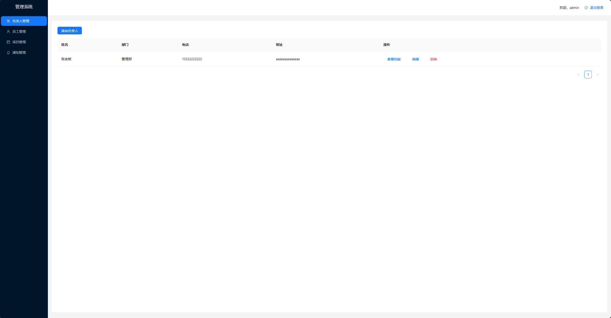
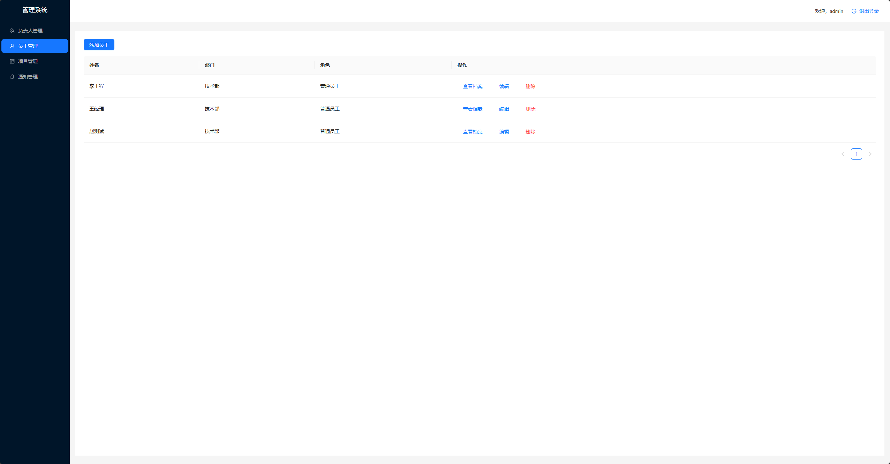
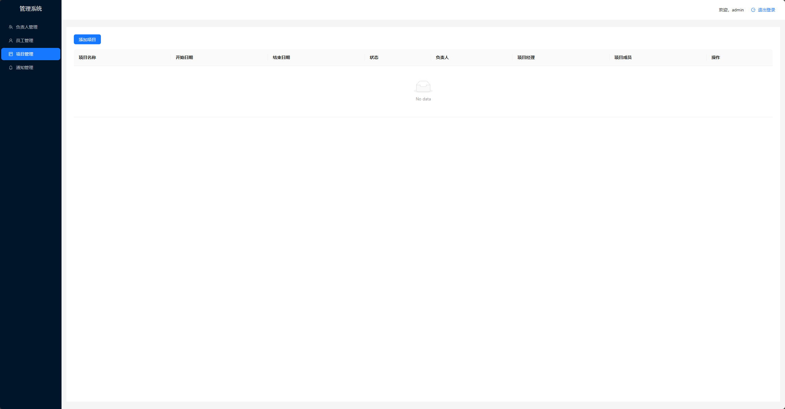
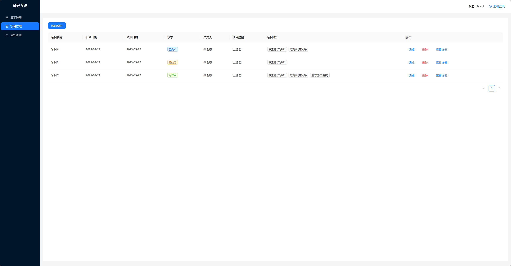
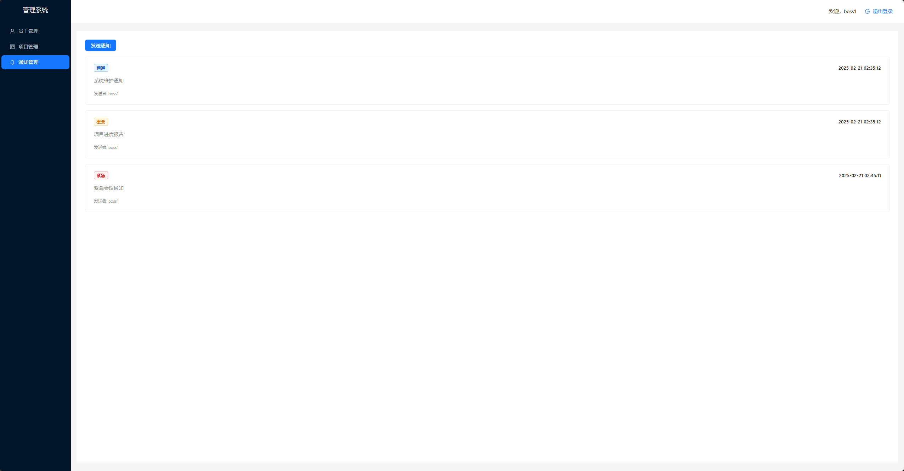
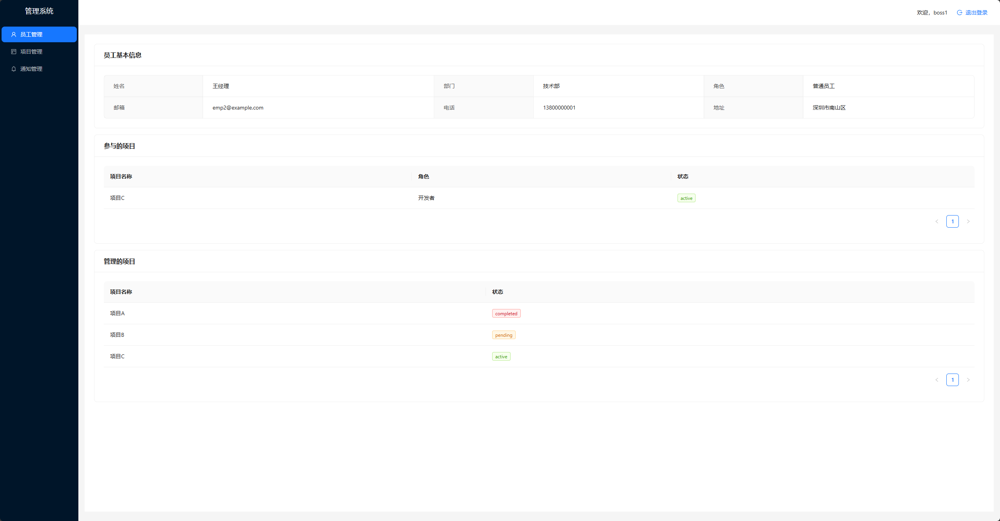
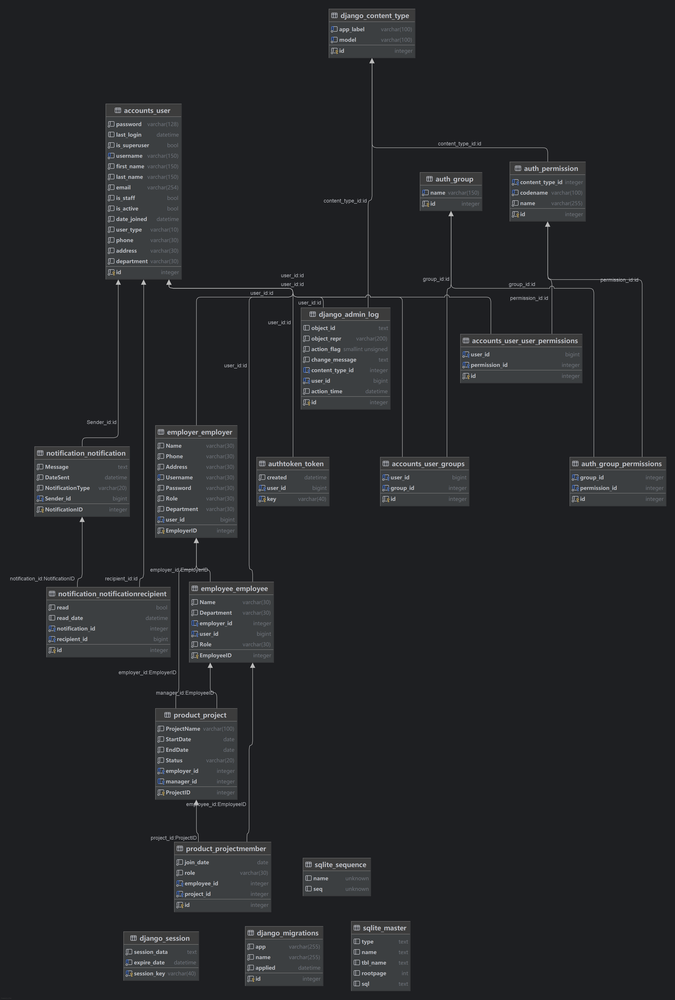

虚拟环境：D:\py-proj\FlaskProjects\.venv\Scripts\activate

前端 [frontend](frontend) react+antd+vite

根据您提供的站点地图内容，可以得出以下 **Dashboard** 的规划：

### **Dashboard 主要功能模块**
1. **Employee Management（员工管理）**
   - **Add Employee（添加员工）**
   - **View Employees（查看员工）**
   - **Employee Profile（员工档案）**

2. **Project Management（项目管理）**
   - **Create Project（创建项目）**
   - **View Projects（查看项目）**
   - **Project Details（项目详情）**

3. **Notifications（通知管理）**
   - **View Notification（查看通知）**
   - **Create Notification（创建通知）**

4. **Manage Permissions（权限管理）**
   - **Assign Roles（分配角色）**

5. **Login（登录）**
   - 用户登录系统。

---

### **Dashboard 的功能规划**
- **核心功能：**
  - 提供员工管理、项目管理、通知管理等核心功能。
  - 支持权限管理和角色分配。

- **用户操作流程：**
  1. 用户通过 **Login** 登录系统。
  2. 进入 Dashboard 后，可以：
     - 查看和管理员工信息（添加、查看、编辑员工档案）。
     - 创建和查看项目，查看项目详情。
     - 查看和创建通知。
     - 分配角色和管理权限。

- **模块划分：**
  - **左侧导航栏：**
    - Employer Management
    - Employee Management
    - Project Management
    - Notifications
  - **主内容区域：**
    - 根据用户选择的模块，显示相应的内容（如员工列表、项目详情、通知列表等）。
---

### **Dashboard 的界面设计建议**
1. **顶部导航栏：**
   - 显示当前用户信息、登录状态、通知图标等。
2. **左侧导航栏：**
   - 提供快速访问各个功能模块的链接。
3. **主内容区域：**
   - 动态显示所选模块的内容，支持数据操作（如添加、编辑、删除）。

### **关系（Relationships）**
1. **EMPLOYER 和 EMPLOYEE**
   - 关系：1 对多（1:M）
   - 描述：一个雇主可以雇佣多个员工。

2. **EMPLOYEE 和 PROJECT**
   - 关系：多对多（M:N）
   - 描述：一个员工可以参与多个项目，一个项目可以由多个员工开发。

3. **EMPLOYER 和 PROJECT**
   - 关系：1 对多（1:M）
   - 描述：一个雇主可以管理多个项目。

4. **NOTIFICATION 和 EMPLOYEE**
   - 关系：1 对多（1:M）
   - 描述：一个通知可以被多个员工接收，一个员工可以接收多个通知。

5. **NOTIFICATION 和 EMPLOYER**
   - 关系：1 对多（1:M）
   - 描述：一个通知可以被多个雇主接收，一个雇主可以接收多个通知。

---

### **ER 图总结**
- **核心实体**：雇主、员工、项目、通知。
- **核心关系**：
  - 雇主与员工之间是雇佣关系（1:M）。
  - 员工与项目之间是开发关系（M:N）。
  - 雇主与项目之间是管理关系（1:M）。
  - 通知与员工、雇主之间是接收关系（1:M）。
---

